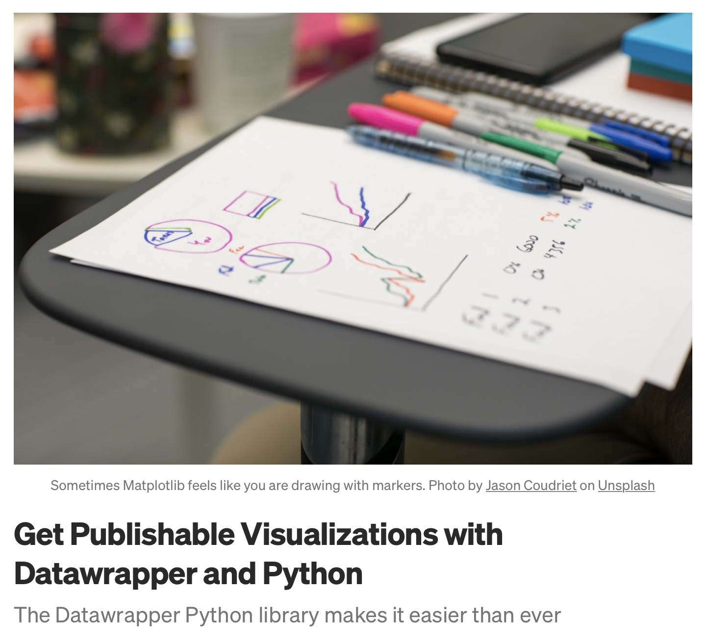

{height=400px}


## Web charting tools

* **[datawrapper](https://www.datawrapper.de)**
* [flouri.sh](https://flourish.studio)

Datawrapper is free & open-source! But you won't be able to control the chart layout unless $

* Easy to use
* Responsive & polished
* **Annotation is a breeze**
* Can send & edit from R 


# 

* Go to [datawrapper](https://app.datawrapper.de), create an account and key your API key


## Send data to datawrapper

```{r eval = F}
library(tidyverse)
library(DatawRappr)

dw_key <- 

# Create a chart
# chart_dw <- dw_create_chart(api_key = dw_key)

read_csv("data/dw_data-F3wwJ.csv") %>% 
  dw_data_to_chart(chart_id = "chartID", api_key = dw_key)


# dw_edit_chart()
# dw_publish_chart(chart_id = "chartID", api_key = dw_key)


```


## Exemples

* [Datawrapper scatter](https://www.letemps.ch/suisse/six-infographies-comprendre-oui-loi-covid)
* [Datawrapper table](https://labs.letemps.ch/interactive/2022/dashboardEco/)


